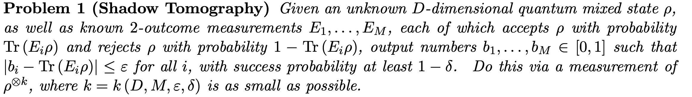

# The shadowy art of classical shadows - Part 1

Recently, I've become interested in a topic of quantum information science called classical shadows of quantum states. It's a topic that not a lot of people pay attention to since most of the work in quantum is oriented towards devising hybrid quantum-classical algorithms that are of use _now_.  I guess people reading this would be like "Pfft, show us a working quantum computer first and then talk about _interesting_  quantum stuff. Heh.". I want to assure my skeptical readers though, that this topic is highly relevant to both near and far term applications in quantum computing. 

## Okay, what are classical shadows? 

 Imagine, you're traveling along a dark alley and it's raining heavily with flashes of lightning in between. Someone runs towards you and hands you a glowing blue box "Hold this! they are coming after me, I can't be found with this!". You may ask "What in the world is this?" and the stranger replies "It's a quantum state, I just don't know how it came to be." You look down at the box and see a glowing $\rho$ symbol on top of the box. Before you can ask the stranger another question, he's vanished in thin air. 

Now, you're a curious person and naturally want to know what's inside.  The box however has an ominous warning label "DO NOT OPEN. Contents will annihilate upon examination." As you scratch your head about ways to explore the contents without "annihilating" yourself, you accidentally shine a light on it and see some image projected on the wall opposite you....

*Record scratch*

Clearly, the story isn't going to satisfy my mathematically oriented readers. So, off to dryland we go.  Imagine you have an unknown quantum state $\rho$ that has been produced by the action of some quantum channel on a $|0\rangle$ state.  Now, quantum states are fragile little creatures since measuring a quantum state collapses it into the outcome state (e.g. if you measure $\rho$ to be $|1\rangle$ then it's going to remain $|1\rangle$ after measurement). If we wanted to know _something_ about the system that produced $\rho$ we will need many copies ($\Omega(D^2)$ for a $D$-dimensional system to be precise). This process is known as _quantum state tomography_. It's very similar to reconstructing a Mummy from it's tomb without opening the said tomb (you know bad things happen if you open _those_). 

Anyways, [Aaronson _et al._](https://arxiv.org/pdf/1711.01053) came up with this idea that you _don't_ need to reconstruct the full Mummy (erm.. I mean quantum state). It will be sufficient to predict _some_ finite properties of this unknown state and thereby gain a _shadow_ of the unknown quantum state in terms of those finite properties. To be more dry, here's the original definition from their work:

<!--  -->

Here $E_1 \dots E_M$ are measurement outcomes when a quantum state in measured in some basis (this defines a probability distribution over the set of possible outcomes). Their key result is this:

Essentially, they say we can predict $M$ properties of an unknown quantum state upto an accuracy $\varepsilon$ with at most $k$ copies of $\rho$ bounded by that big $\tilde{O}$ . The bound depends on the number of properties $M$ we want to predict (poly-logarithmically) and _logarithmically_ with the system size $D$. 

Now, this seems to be a decent bound since we scale logarithmically with system size, it means we can at least handle sizes of a few 100 qubits. However, one key part that I omitted earlier was that in order to be able to do a shadow tomography we need to store $k$ copies of that state in _quantum memory_. Going back to our story earlier, it means we'll need to track down our shady quantum state dealer these many times if we want to know what was in the box.

*Cue sad cello music*

## Along came Preskill

Gondor then seemed to be lost to the dark lord then and all the men were fearing dark times upon them. Then over the horizon, a brilliant flash of light grew and kept on growing "Gandalf..." said men with a renewed hope. Well, in this case the brilliant flash of light was [a paper](https://arxiv.org/pdf/2002.08953.pdf) by Huang, Preskil _et al_. 

This paper presented a very counterintuitive protocol _and_ showed that their idea wasn't just crazy hand waving that worked for some cases. It had rigorous performance guarantees which were _independent_ of the system size. The idea is this: We take the unknown quantum state $\rho$ and perform a measurement by appending a random unitary $U$ sampled from some ensemble $\mathcal{U}$ and obtaining a bitstring $|b\rangle$ . We repeat this procedure $N$ times and end up having a snapshot of the quantum state in a _classical format_. This was called a classical shadow of a quantum state and is compactly written as:

$$
S(\rho; N) = [\hat{\rho}_1, \hat{\rho}_2, \dots \hat{\rho}_N]
$$
Where $\hat{\rho} = \mathcal{M}^{-1}(U^\dagger |b\rangle \langle b| U)$ and $|b\rangle \in \{0, 1\}$ . The justification for doing this is that this shadow describes a quantum channel that should evaluate to the input state $\rho$ _in expectation_. Here $\mathcal{M}$ describes a quantum channel with a random unitary transformation i.e. $\mathcal{M}(\rho) = E[U^\dagger |b\rangle |b\langle U]$. The "in expectation" part comes by inverting this channel $\rho = E[\mathcal{M}^{-1}(U^\dagger |b\rangle |b\langle U)]$ . This channel is not a physical channel but nevertheless can be inverted. The authors provide the inverse channel when ensemble $\mathcal{U}$ is either a Clifford group or a Clifford group with only single qubit gates included (equivalent to measuring in Pauli basis). 

The protocol prescribed is very simple in practice: 
- We take our unknown quantum state $\rho$ and perform $N$ random rotations and obtain the shadow. 
- Once obtained, we use this as a proxy for a true quantum state and predict various properties of a quantum system by _operating completely in classical space._

Most of the tomography literature was focused on obtaining a "close enough" version of an unknown quantum state $\rho$ . The works by Aaronson and this one allowed us to ask more from the shadow we mined in the depths of Minas-Tritnh. For example, we wish to predict various linear properties of the quantum system. Classical shadows enable us to do so, without really caring about the unknown quantum state.  Once we acquire the shadow, we can work completely in _classical_ space and process this information via classical transforms. Let's say we have some quantum observables $O_1, O_2, \dots O_M$ and we want to predict their properties. Assuming we have access to a classical shadow $\hat{\rho} = S(\rho; N)$ we can predict $Tr[O_i\hat{\rho}]$ by using a median-of-means approximation presented in Algorithm 1 of the paper. More importantly, here's the bound on the number of samples required to approximate the expectation values of quantum observables up to a certain accuracy $\epsilon$ :

It shows that we only need samples that scale _logarithmically_ with the _number of observables_. The bound is independent of system size since the $||O||^2_{shadow}$ depends on the  type of ensemble one samples from. If $\mathcal{U} = Cl(2^n)$ (i.e. the clifford group), then the expression after $log(M)$ is upper bounded by operator norm $Tr[O]^2$  and if $\mathcal{U} = Cl(2)^{\otimes n}$ i.e. single qubit cliffords then the expression is upper bounded as $4^{k}||O||^2_{\infty}$ where $k$ is the locality (i.e. number of qubits a particular single qubit gate acts on). Thus, we can reliably predict $M$ properties of quantum observables by simply acquiring a classical representation and computing $Tr[O\hat{\rho}]$ with a finite number of samples. 

I've barely scratched the surface in this blogpost, in the next one, I'll discuss the wonderful applications of these classical shadows beyond what we show today.

Toodles!